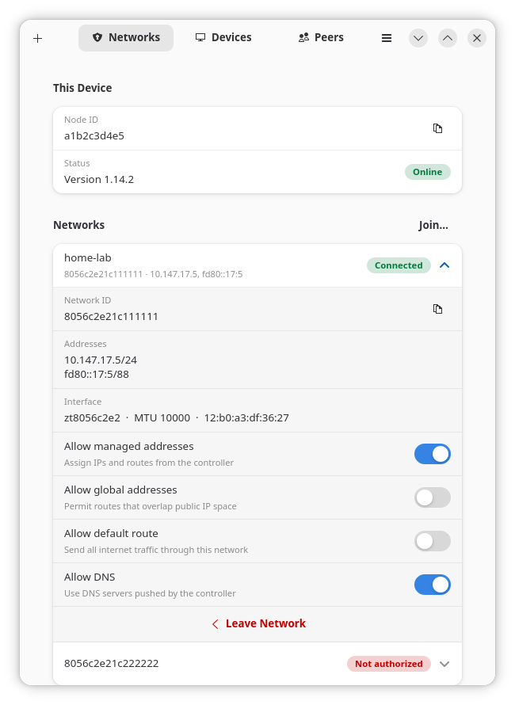
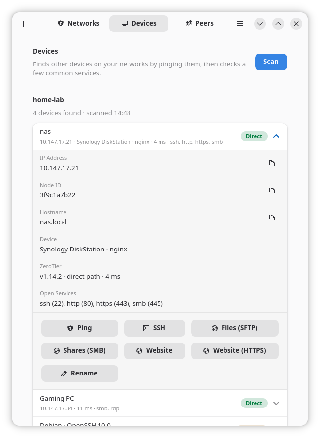
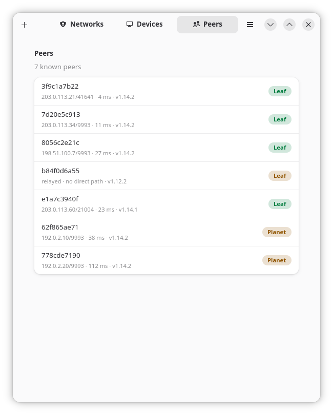
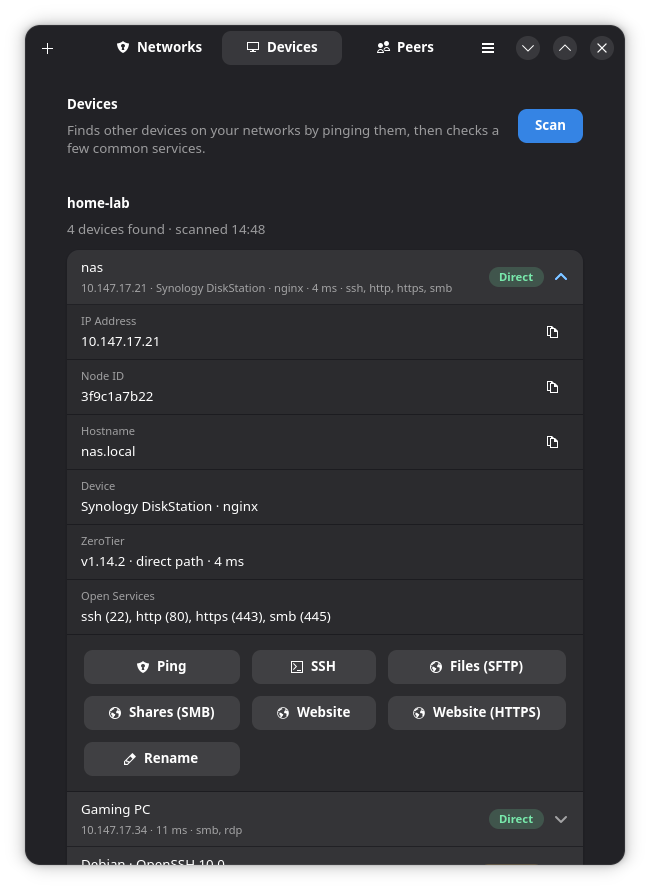

# ZeroTier GUI

An unofficial desktop app for managing ZeroTier One on Linux.

**Disclaimer:** This project is not affiliated with or endorsed by ZeroTier, Inc. "ZeroTier" is a trademark of ZeroTier, Inc.

## Screenshots

| Networks | Devices | Peers |
|:---:|:---:|:---:|
|  |  |  |

<p align="center"></p>

The screenshots show demo data (see [Development](#development)); they follow your system's light or dark style.

## Overview

ZeroTier GUI provides a native Linux desktop interface for the ZeroTier One service, built with Python 3.11+, GTK 4 and libadwaita (≥ 1.6). It has been developed and tested on KDE Plasma 6 (Wayland) on Arch-based Linux. It should work on other desktops; the tray icon requires a desktop that supports StatusNotifierItem (KDE Plasma; GNOME requires the AppIndicator extension).

## Features

- **Networks tab:** View your node ID and online status. Manage joined networks, see assigned IPs and interfaces. Toggle Allow managed, global routes, default route and DNS settings. Join networks by 16-digit ID (auto-populated from clipboard) or leave with confirmation.

- **Devices tab:** Discover other devices on your networks by scanning private address ranges (max ~1024 hosts per network). Maps IPs to ZeroTier node IDs, resolves hostnames via reverse DNS, NetBIOS, mDNS and LLMNR, and identifies devices from SSH/HTTP banners. Per-device tools: Ping, SSH (opens a terminal), SFTP file browser, SMB shares, web UI links, Remote Desktop for RDP/VNC (uses KRDC, Remmina, GNOME Connections, FreeRDP or TigerVNC, whichever is installed, including Flatpaks; if none is, it shows the command to install one), and local nicknames.

  Note: a scan pings every address in the network's subnet and probes a few common ports on devices that answer. Only scan networks where that is acceptable to the other members.

- **Peers tab:** View known ZeroTier peers with path information and latency.

- **Tray icon:** StatusNotifierItem integration (no extra dependencies). Left-click to show/hide window. Menu includes status, per-network actions (copy IP, copy network ID, leave), Rejoin for networks you've left, Devices submenu, Start at Login, service control, and Quit. Icon reflects current status.

- **Central integration (optional):** With a ZeroTier Central API token, list your account's networks and join + authorize this device in one click. API tokens may require a paid ZeroTier plan. Connect via the menu ("Connect ZeroTier Account…"); the section stays hidden otherwise. The token is stored at `~/.config/zerotier-gui/central_token` (mode 600).

## Installation

**Requirements (Arch package names):** `python-gobject gtk4 libadwaita zerotier-one polkit`. Optional: `avahi` (mDNS), `konsole` or another terminal, `dolphin` (file browser), `krdc` or another RDP/VNC client (remote desktop).

```bash
git clone https://github.com/leifrossau/zerotier-gui.git
cd zerotier-gui
./install.sh                 # User install: ~/.local/share/zerotier-gui, ~/.local/bin/zerotier-gui
sudo ./install-system.sh     # Once: root-owned helper + polkit policy
```

Uninstall: `./install.sh --uninstall` and `sudo ./install-system.sh --uninstall`.

Run: App menu "ZeroTier GUI" or `zerotier-gui` (`zerotier-gui --hidden` starts in tray).

## First Run

If the service isn't running or the app lacks access, a button prompts you to enable and start `zerotier-one.service` (via polkit password), which also copies the service auth token to `~/.zeroTierOneAuthToken` (mode 600).

## Configuration

- `~/.zeroTierOneAuthToken`: Service auth token for non-root access
- `~/.config/zerotier-gui/nicknames.json`: Device nicknames
- `~/.config/zerotier-gui/known_networks.json`: Networks you left, offered under Rejoin in the tray
- `~/.config/zerotier-gui/central_token`: Central API token (mode 600)
- `~/.config/autostart/zerotier-gui.desktop`: Auto-start link (created when "Start at Login" is enabled)

## Development

Mock the ZeroTier service without a real installation:

```bash
python3 mock_zt.py --port 19993 --token test &
ZT_PORT=19993 ZT_TOKEN=test python3 zerotier_gui.py
```

To see the app with made-up devices (this is how the screenshots are made), run the demo. It starts the mock service on a free port, uses a throwaway config directory and fakes the device scan, so it never touches a real service or device:

```bash
python3 tools/demo.py --page devices --expand        # also: --page networks|peers, --dark
```

For Central API mocking:
```bash
python3 mock_central.py --port 19995 --token centraltest &
ZT_PORT=19993 ZT_TOKEN=test ZT_CENTRAL_URL=http://127.0.0.1:19995/api/v1 ZT_CENTRAL_TOKEN=centraltest python3 zerotier_gui.py
```

## Files

| File | Purpose |
|------|---------|
| `zerotier_gui.py` | The application (GTK 4 / libadwaita) |
| `zt_api.py` | Client for the local ZeroTier One service API |
| `zt_discover.py` | Device discovery on joined networks |
| `zt_tray.py` | Tray icon (StatusNotifierItem + dbusmenu over D-Bus) |
| `zt_central.py` | ZeroTier Central API client |
| `zt-gui-helper.sh` | Privileged helper, installed to `/usr/local/libexec/zerotier-gui/zt-gui-helper` |
| `io.github.leifrossau.zerotiergui.policy` | polkit policy for the helper |
| `install.sh`, `install-system.sh` | User install and one-time system install |
| `mock_zt.py`, `mock_central.py` | Mock servers for development |
| `tools/demo.py` | Runs the app on demo data (used for the screenshots) |

See [SECURITY.md](SECURITY.md) for the security model and how to report vulnerabilities.

## License

MIT. See LICENSE file.

## How it was built

Written with the help of AI coding assistants (Claude) and tested on a live ZeroTier network.
